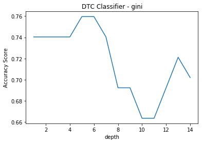

<a href="https://www.bigdatauniversity.com"></a>

<h1 align="center"><font size="5">Machine Learning Classification</font></h1>

In this notebook we try to find the best classification algorithm for this specific dataset by accuracy evaluation methods.

Lets first load required libraries:


```python
import itertools
import numpy as np
import matplotlib.pyplot as plt
from matplotlib.ticker import NullFormatter
import pandas as pd
import numpy as np
import matplotlib.ticker as ticker
from sklearn import preprocessing
%matplotlib inline
```

### About dataset

This dataset is about past loans. The __Loan_train.csv__ data set includes details of 346 customers whose loan are already paid off or defaulted. It includes following fields:

| Field          | Description                                                                           |
|----------------|---------------------------------------------------------------------------------------|
| Loan_status    | Whether a loan is paid off on in collection                                           |
| Principal      | Basic principal loan amount at the                                                    |
| Terms          | Origination terms which can be weekly (7 days), biweekly, and monthly payoff schedule |
| Effective_date | When the loan got originated and took effects                                         |
| Due_date       | Since it’s one-time payoff schedule, each loan has one single due date                |
| Age            | Age of applicant                                                                      |
| Education      | Education of applicant                                                                |
| Gender         | The gender of applicant                                                               |

Lets download the dataset


```python
!wget -O loan_train.csv https://s3-api.us-geo.objectstorage.softlayer.net/cf-courses-data/CognitiveClass/ML0101ENv3/labs/loan_train.csv
```

    --2020-06-01 19:26:57--  https://s3-api.us-geo.objectstorage.softlayer.net/cf-courses-data/CognitiveClass/ML0101ENv3/labs/loan_train.csv
    Resolving s3-api.us-geo.objectstorage.softlayer.net (s3-api.us-geo.objectstorage.softlayer.net)... 67.228.254.196
    Connecting to s3-api.us-geo.objectstorage.softlayer.net (s3-api.us-geo.objectstorage.softlayer.net)|67.228.254.196|:443... connected.
    HTTP request sent, awaiting response... 200 OK
    Length: 23101 (23K) [text/csv]
    Saving to: ‘loan_train.csv’
    
    100%[======================================>] 23,101      --.-K/s   in 0.002s  
    
    2020-06-01 19:26:57 (14.1 MB/s) - ‘loan_train.csv’ saved [23101/23101]
    


### Load Data From CSV File  


```python
df = pd.read_csv('loan_train.csv')
df[0:10]
```


<div>
<style scoped>
    .dataframe tbody tr th:only-of-type {
        vertical-align: middle;
    }

    .dataframe tbody tr th {
        vertical-align: top;
    }

    .dataframe thead th {
        text-align: right;
    }
</style>
<table border="1" class="dataframe">
  <thead>
    <tr style="text-align: right;">
      <th></th>
      <th>Unnamed: 0</th>
      <th>Unnamed: 0.1</th>
      <th>loan_status</th>
      <th>Principal</th>
      <th>terms</th>
      <th>effective_date</th>
      <th>due_date</th>
      <th>age</th>
      <th>education</th>
      <th>Gender</th>
    </tr>
  </thead>
  <tbody>
    <tr>
      <th>0</th>
      <td>0</td>
      <td>0</td>
      <td>PAIDOFF</td>
      <td>1000</td>
      <td>30</td>
      <td>9/8/2016</td>
      <td>10/7/2016</td>
      <td>45</td>
      <td>High School or Below</td>
      <td>male</td>
    </tr>
    <tr>
      <th>1</th>
      <td>2</td>
      <td>2</td>
      <td>PAIDOFF</td>
      <td>1000</td>
      <td>30</td>
      <td>9/8/2016</td>
      <td>10/7/2016</td>
      <td>33</td>
      <td>Bechalor</td>
      <td>female</td>
    </tr>
    <tr>
      <th>2</th>
      <td>3</td>
      <td>3</td>
      <td>PAIDOFF</td>
      <td>1000</td>
      <td>15</td>
      <td>9/8/2016</td>
      <td>9/22/2016</td>
      <td>27</td>
      <td>college</td>
      <td>male</td>
    </tr>
    <tr>
      <th>3</th>
      <td>4</td>
      <td>4</td>
      <td>PAIDOFF</td>
      <td>1000</td>
      <td>30</td>
      <td>9/9/2016</td>
      <td>10/8/2016</td>
      <td>28</td>
      <td>college</td>
      <td>female</td>
    </tr>
    <tr>
      <th>4</th>
      <td>6</td>
      <td>6</td>
      <td>PAIDOFF</td>
      <td>1000</td>
      <td>30</td>
      <td>9/9/2016</td>
      <td>10/8/2016</td>
      <td>29</td>
      <td>college</td>
      <td>male</td>
    </tr>
    <tr>
      <th>5</th>
      <td>7</td>
      <td>7</td>
      <td>PAIDOFF</td>
      <td>1000</td>
      <td>30</td>
      <td>9/9/2016</td>
      <td>10/8/2016</td>
      <td>36</td>
      <td>college</td>
      <td>male</td>
    </tr>
    <tr>
      <th>6</th>
      <td>8</td>
      <td>8</td>
      <td>PAIDOFF</td>
      <td>1000</td>
      <td>30</td>
      <td>9/9/2016</td>
      <td>10/8/2016</td>
      <td>28</td>
      <td>college</td>
      <td>male</td>
    </tr>
    <tr>
      <th>7</th>
      <td>9</td>
      <td>9</td>
      <td>PAIDOFF</td>
      <td>800</td>
      <td>15</td>
      <td>9/10/2016</td>
      <td>9/24/2016</td>
      <td>26</td>
      <td>college</td>
      <td>male</td>
    </tr>
    <tr>
      <th>8</th>
      <td>10</td>
      <td>10</td>
      <td>PAIDOFF</td>
      <td>300</td>
      <td>7</td>
      <td>9/10/2016</td>
      <td>9/16/2016</td>
      <td>29</td>
      <td>college</td>
      <td>male</td>
    </tr>
    <tr>
      <th>9</th>
      <td>11</td>
      <td>11</td>
      <td>PAIDOFF</td>
      <td>1000</td>
      <td>15</td>
      <td>9/10/2016</td>
      <td>10/9/2016</td>
      <td>39</td>
      <td>High School or Below</td>
      <td>male</td>
    </tr>
  </tbody>
</table>
</div>


```python
df.shape
```


    (346, 10)


### Convert to date time object 


```python
df['due_date'] = pd.to_datetime(df['due_date'])
df['effective_date'] = pd.to_datetime(df['effective_date'])
df.head()
```


<div>
<style scoped>
    .dataframe tbody tr th:only-of-type {
        vertical-align: middle;
    }

    .dataframe tbody tr th {
        vertical-align: top;
    }

    .dataframe thead th {
        text-align: right;
    }
</style>
<table border="1" class="dataframe">
  <thead>
    <tr style="text-align: right;">
      <th></th>
      <th>Unnamed: 0</th>
      <th>Unnamed: 0.1</th>
      <th>loan_status</th>
      <th>Principal</th>
      <th>terms</th>
      <th>effective_date</th>
      <th>due_date</th>
      <th>age</th>
      <th>education</th>
      <th>Gender</th>
    </tr>
  </thead>
  <tbody>
    <tr>
      <th>0</th>
      <td>0</td>
      <td>0</td>
      <td>PAIDOFF</td>
      <td>1000</td>
      <td>30</td>
      <td>2016-09-08</td>
      <td>2016-10-07</td>
      <td>45</td>
      <td>High School or Below</td>
      <td>male</td>
    </tr>
    <tr>
      <th>1</th>
      <td>2</td>
      <td>2</td>
      <td>PAIDOFF</td>
      <td>1000</td>
      <td>30</td>
      <td>2016-09-08</td>
      <td>2016-10-07</td>
      <td>33</td>
      <td>Bechalor</td>
      <td>female</td>
    </tr>
    <tr>
      <th>2</th>
      <td>3</td>
      <td>3</td>
      <td>PAIDOFF</td>
      <td>1000</td>
      <td>15</td>
      <td>2016-09-08</td>
      <td>2016-09-22</td>
      <td>27</td>
      <td>college</td>
      <td>male</td>
    </tr>
    <tr>
      <th>3</th>
      <td>4</td>
      <td>4</td>
      <td>PAIDOFF</td>
      <td>1000</td>
      <td>30</td>
      <td>2016-09-09</td>
      <td>2016-10-08</td>
      <td>28</td>
      <td>college</td>
      <td>female</td>
    </tr>
    <tr>
      <th>4</th>
      <td>6</td>
      <td>6</td>
      <td>PAIDOFF</td>
      <td>1000</td>
      <td>30</td>
      <td>2016-09-09</td>
      <td>2016-10-08</td>
      <td>29</td>
      <td>college</td>
      <td>male</td>
    </tr>
  </tbody>
</table>
</div>


# Data visualization and pre-processing


Let’s see how many of each class is in our data set 


```python
df['loan_status'].value_counts()
```


    PAIDOFF       260
    COLLECTION     86
    Name: loan_status, dtype: int64


260 people have paid off the loan on time while 86 have gone into collection 


Lets plot some columns to underestand data better:


```python
# notice: installing seaborn might takes a few minutes
!conda install -c anaconda seaborn -y
```

    Solving environment: | ^C
    failed
    
    CondaError: KeyboardInterrupt
    


```python
import seaborn as sns

bins = np.linspace(df.Principal.min(), df.Principal.max(), 10)
g = sns.FacetGrid(df, col="Gender", hue="loan_status", palette="Set1", col_wrap=2)
g.map(plt.hist, 'Principal', bins=bins, ec="k")

g.axes[-1].legend()
plt.show()
```


```python
bins = np.linspace(df.age.min(), df.age.max(), 10)
g = sns.FacetGrid(df, col="Gender", hue="loan_status", palette="Set1", col_wrap=2)
g.map(plt.hist, 'age', bins=bins, ec="k")

g.axes[-1].legend()
plt.show()
```


# Pre-processing:  Feature selection/extraction

### Lets look at the day of the week people get the loan 


```python
df['dayofweek'] = df['effective_date'].dt.dayofweek
bins = np.linspace(df.dayofweek.min(), df.dayofweek.max(), 10)
g = sns.FacetGrid(df, col="Gender", hue="loan_status", palette="Set1", col_wrap=2)
g.map(plt.hist, 'dayofweek', bins=bins, ec="k")
g.axes[-1].legend()
plt.show()

```


We see that people who get the loan at the end of the week dont pay it off, so lets use Feature binarization to set a threshold values less then day 4 


```python
df['weekend'] = df['dayofweek'].apply(lambda x: 1 if (x>3)  else 0)
df.head()
```


<div>
<style scoped>
    .dataframe tbody tr th:only-of-type {
        vertical-align: middle;
    }

    .dataframe tbody tr th {
        vertical-align: top;
    }

    .dataframe thead th {
        text-align: right;
    }
</style>
<table border="1" class="dataframe">
  <thead>
    <tr style="text-align: right;">
      <th></th>
      <th>Unnamed: 0</th>
      <th>Unnamed: 0.1</th>
      <th>loan_status</th>
      <th>Principal</th>
      <th>terms</th>
      <th>effective_date</th>
      <th>due_date</th>
      <th>age</th>
      <th>education</th>
      <th>Gender</th>
      <th>dayofweek</th>
      <th>weekend</th>
    </tr>
  </thead>
  <tbody>
    <tr>
      <th>0</th>
      <td>0</td>
      <td>0</td>
      <td>PAIDOFF</td>
      <td>1000</td>
      <td>30</td>
      <td>2016-09-08</td>
      <td>2016-10-07</td>
      <td>45</td>
      <td>High School or Below</td>
      <td>male</td>
      <td>3</td>
      <td>0</td>
    </tr>
    <tr>
      <th>1</th>
      <td>2</td>
      <td>2</td>
      <td>PAIDOFF</td>
      <td>1000</td>
      <td>30</td>
      <td>2016-09-08</td>
      <td>2016-10-07</td>
      <td>33</td>
      <td>Bechalor</td>
      <td>female</td>
      <td>3</td>
      <td>0</td>
    </tr>
    <tr>
      <th>2</th>
      <td>3</td>
      <td>3</td>
      <td>PAIDOFF</td>
      <td>1000</td>
      <td>15</td>
      <td>2016-09-08</td>
      <td>2016-09-22</td>
      <td>27</td>
      <td>college</td>
      <td>male</td>
      <td>3</td>
      <td>0</td>
    </tr>
    <tr>
      <th>3</th>
      <td>4</td>
      <td>4</td>
      <td>PAIDOFF</td>
      <td>1000</td>
      <td>30</td>
      <td>2016-09-09</td>
      <td>2016-10-08</td>
      <td>28</td>
      <td>college</td>
      <td>female</td>
      <td>4</td>
      <td>1</td>
    </tr>
    <tr>
      <th>4</th>
      <td>6</td>
      <td>6</td>
      <td>PAIDOFF</td>
      <td>1000</td>
      <td>30</td>
      <td>2016-09-09</td>
      <td>2016-10-08</td>
      <td>29</td>
      <td>college</td>
      <td>male</td>
      <td>4</td>
      <td>1</td>
    </tr>
  </tbody>
</table>
</div>


## Convert Categorical features to numerical values

Lets look at gender:


```python
df.groupby(['Gender'])['loan_status'].value_counts(normalize=True)
```


    Gender  loan_status
    female  PAIDOFF        0.865385
            COLLECTION     0.134615
    male    PAIDOFF        0.731293
            COLLECTION     0.268707
    Name: loan_status, dtype: float64


86 % of female pay there loans while only 73 % of males pay there loan


Lets convert male to 0 and female to 1:


```python
df['Gender'].replace(to_replace=['male','female'], value=[0,1],inplace=True)
df['loan_status'].replace(to_replace=['PAIDOFF','COLLECTION'], value=[0,1],inplace=True)
df.head()
```


<div>
<style scoped>
    .dataframe tbody tr th:only-of-type {
        vertical-align: middle;
    }

    .dataframe tbody tr th {
        vertical-align: top;
    }

    .dataframe thead th {
        text-align: right;
    }
</style>
<table border="1" class="dataframe">
  <thead>
    <tr style="text-align: right;">
      <th></th>
      <th>Unnamed: 0</th>
      <th>Unnamed: 0.1</th>
      <th>loan_status</th>
      <th>Principal</th>
      <th>terms</th>
      <th>effective_date</th>
      <th>due_date</th>
      <th>age</th>
      <th>education</th>
      <th>Gender</th>
      <th>dayofweek</th>
      <th>weekend</th>
    </tr>
  </thead>
  <tbody>
    <tr>
      <th>0</th>
      <td>0</td>
      <td>0</td>
      <td>0</td>
      <td>1000</td>
      <td>30</td>
      <td>2016-09-08</td>
      <td>2016-10-07</td>
      <td>45</td>
      <td>High School or Below</td>
      <td>0</td>
      <td>3</td>
      <td>0</td>
    </tr>
    <tr>
      <th>1</th>
      <td>2</td>
      <td>2</td>
      <td>0</td>
      <td>1000</td>
      <td>30</td>
      <td>2016-09-08</td>
      <td>2016-10-07</td>
      <td>33</td>
      <td>Bechalor</td>
      <td>1</td>
      <td>3</td>
      <td>0</td>
    </tr>
    <tr>
      <th>2</th>
      <td>3</td>
      <td>3</td>
      <td>0</td>
      <td>1000</td>
      <td>15</td>
      <td>2016-09-08</td>
      <td>2016-09-22</td>
      <td>27</td>
      <td>college</td>
      <td>0</td>
      <td>3</td>
      <td>0</td>
    </tr>
    <tr>
      <th>3</th>
      <td>4</td>
      <td>4</td>
      <td>0</td>
      <td>1000</td>
      <td>30</td>
      <td>2016-09-09</td>
      <td>2016-10-08</td>
      <td>28</td>
      <td>college</td>
      <td>1</td>
      <td>4</td>
      <td>1</td>
    </tr>
    <tr>
      <th>4</th>
      <td>6</td>
      <td>6</td>
      <td>0</td>
      <td>1000</td>
      <td>30</td>
      <td>2016-09-09</td>
      <td>2016-10-08</td>
      <td>29</td>
      <td>college</td>
      <td>0</td>
      <td>4</td>
      <td>1</td>
    </tr>
  </tbody>
</table>
</div>


## One Hot Encoding  
#### How about education?


```python
df.groupby(['education'])['loan_status'].value_counts(normalize=True)
```


    education             loan_status
    Bechalor              0              0.750000
                          1              0.250000
    High School or Below  0              0.741722
                          1              0.258278
    Master or Above       0              0.500000
                          1              0.500000
    college               0              0.765101
                          1              0.234899
    Name: loan_status, dtype: float64


#### Feature befor One Hot Encoding


```python
df[['Principal','terms','age','Gender','education']].head()
```


<div>
<style scoped>
    .dataframe tbody tr th:only-of-type {
        vertical-align: middle;
    }

    .dataframe tbody tr th {
        vertical-align: top;
    }

    .dataframe thead th {
        text-align: right;
    }
</style>
<table border="1" class="dataframe">
  <thead>
    <tr style="text-align: right;">
      <th></th>
      <th>Principal</th>
      <th>terms</th>
      <th>age</th>
      <th>Gender</th>
      <th>education</th>
    </tr>
  </thead>
  <tbody>
    <tr>
      <th>0</th>
      <td>1000</td>
      <td>30</td>
      <td>45</td>
      <td>0</td>
      <td>High School or Below</td>
    </tr>
    <tr>
      <th>1</th>
      <td>1000</td>
      <td>30</td>
      <td>33</td>
      <td>1</td>
      <td>Bechalor</td>
    </tr>
    <tr>
      <th>2</th>
      <td>1000</td>
      <td>15</td>
      <td>27</td>
      <td>0</td>
      <td>college</td>
    </tr>
    <tr>
      <th>3</th>
      <td>1000</td>
      <td>30</td>
      <td>28</td>
      <td>1</td>
      <td>college</td>
    </tr>
    <tr>
      <th>4</th>
      <td>1000</td>
      <td>30</td>
      <td>29</td>
      <td>0</td>
      <td>college</td>
    </tr>
  </tbody>
</table>
</div>


#### Use one hot encoding technique to conver categorical varables to binary variables and append them to the feature Data Frame 


```python
Feature = df[['Principal','terms','age','Gender','weekend']]
Feature = pd.concat([Feature,pd.get_dummies(df['education'])], axis=1)
Feature.drop(['Master or Above'], axis = 1,inplace=True)
Feature.head()

```


<div>
<style scoped>
    .dataframe tbody tr th:only-of-type {
        vertical-align: middle;
    }

    .dataframe tbody tr th {
        vertical-align: top;
    }

    .dataframe thead th {
        text-align: right;
    }
</style>
<table border="1" class="dataframe">
  <thead>
    <tr style="text-align: right;">
      <th></th>
      <th>Principal</th>
      <th>terms</th>
      <th>age</th>
      <th>Gender</th>
      <th>weekend</th>
      <th>Bechalor</th>
      <th>High School or Below</th>
      <th>college</th>
    </tr>
  </thead>
  <tbody>
    <tr>
      <th>0</th>
      <td>1000</td>
      <td>30</td>
      <td>45</td>
      <td>0</td>
      <td>0</td>
      <td>0</td>
      <td>1</td>
      <td>0</td>
    </tr>
    <tr>
      <th>1</th>
      <td>1000</td>
      <td>30</td>
      <td>33</td>
      <td>1</td>
      <td>0</td>
      <td>1</td>
      <td>0</td>
      <td>0</td>
    </tr>
    <tr>
      <th>2</th>
      <td>1000</td>
      <td>15</td>
      <td>27</td>
      <td>0</td>
      <td>0</td>
      <td>0</td>
      <td>0</td>
      <td>1</td>
    </tr>
    <tr>
      <th>3</th>
      <td>1000</td>
      <td>30</td>
      <td>28</td>
      <td>1</td>
      <td>1</td>
      <td>0</td>
      <td>0</td>
      <td>1</td>
    </tr>
    <tr>
      <th>4</th>
      <td>1000</td>
      <td>30</td>
      <td>29</td>
      <td>0</td>
      <td>1</td>
      <td>0</td>
      <td>0</td>
      <td>1</td>
    </tr>
  </tbody>
</table>
</div>


### Feature selection

Lets defind feature sets, X:


```python
X = Feature
X[0:5]
```


<div>
<style scoped>
    .dataframe tbody tr th:only-of-type {
        vertical-align: middle;
    }

    .dataframe tbody tr th {
        vertical-align: top;
    }

    .dataframe thead th {
        text-align: right;
    }
</style>
<table border="1" class="dataframe">
  <thead>
    <tr style="text-align: right;">
      <th></th>
      <th>Principal</th>
      <th>terms</th>
      <th>age</th>
      <th>Gender</th>
      <th>weekend</th>
      <th>Bechalor</th>
      <th>High School or Below</th>
      <th>college</th>
    </tr>
  </thead>
  <tbody>
    <tr>
      <th>0</th>
      <td>1000</td>
      <td>30</td>
      <td>45</td>
      <td>0</td>
      <td>0</td>
      <td>0</td>
      <td>1</td>
      <td>0</td>
    </tr>
    <tr>
      <th>1</th>
      <td>1000</td>
      <td>30</td>
      <td>33</td>
      <td>1</td>
      <td>0</td>
      <td>1</td>
      <td>0</td>
      <td>0</td>
    </tr>
    <tr>
      <th>2</th>
      <td>1000</td>
      <td>15</td>
      <td>27</td>
      <td>0</td>
      <td>0</td>
      <td>0</td>
      <td>0</td>
      <td>1</td>
    </tr>
    <tr>
      <th>3</th>
      <td>1000</td>
      <td>30</td>
      <td>28</td>
      <td>1</td>
      <td>1</td>
      <td>0</td>
      <td>0</td>
      <td>1</td>
    </tr>
    <tr>
      <th>4</th>
      <td>1000</td>
      <td>30</td>
      <td>29</td>
      <td>0</td>
      <td>1</td>
      <td>0</td>
      <td>0</td>
      <td>1</td>
    </tr>
  </tbody>
</table>
</div>


What are our lables?


```python
y = df['loan_status'].values
y[0:5]
```


    array([0, 0, 0, 0, 0])


## Normalize Data 

Data Standardization give data zero mean and unit variance (technically should be done after train test split )


```python
X= preprocessing.StandardScaler().fit(X).transform(X)
X[0:5]
```

    /opt/conda/envs/Python36/lib/python3.6/site-packages/sklearn/preprocessing/data.py:645: DataConversionWarning: Data with input dtype uint8, int64 were all converted to float64 by StandardScaler.
      return self.partial_fit(X, y)
    /opt/conda/envs/Python36/lib/python3.6/site-packages/ipykernel/__main__.py:1: DataConversionWarning: Data with input dtype uint8, int64 were all converted to float64 by StandardScaler.
      if __name__ == '__main__':


    array([[ 0.51578458,  0.92071769,  2.33152555, -0.42056004, -1.20577805,
            -0.38170062,  1.13639374, -0.86968108],
           [ 0.51578458,  0.92071769,  0.34170148,  2.37778177, -1.20577805,
             2.61985426, -0.87997669, -0.86968108],
           [ 0.51578458, -0.95911111, -0.65321055, -0.42056004, -1.20577805,
            -0.38170062, -0.87997669,  1.14984679],
           [ 0.51578458,  0.92071769, -0.48739188,  2.37778177,  0.82934003,
            -0.38170062, -0.87997669,  1.14984679],
           [ 0.51578458,  0.92071769, -0.3215732 , -0.42056004,  0.82934003,
            -0.38170062, -0.87997669,  1.14984679]])


# Classification 

Now, it is your turn, use the training set to build an accurate model. Then use the test set to report the accuracy of the model
You should use the following algorithm:
- K Nearest Neighbor(KNN)
- Decision Tree
- Support Vector Machine
- Logistic Regression


__ Notice:__ 
- You can go above and change the pre-processing, feature selection, feature-extraction, and so on, to make a better model.
- You should use either scikit-learn, Scipy or Numpy libraries for developing the classification algorithms.
- You should include the code of the algorithm in the following cells.

# K Nearest Neighbor(KNN)
Notice: You should find the best k to build the model with the best accuracy.  
**warning:** You should not use the __loan_test.csv__ for finding the best k, however, you can split your train_loan.csv into train and test to find the best __k__.


```python
from sklearn.model_selection import train_test_split
from sklearn.neighbors import KNeighborsClassifier
from sklearn import metrics 

x_train, x_test, y_train, y_test = train_test_split(X, y, test_size=0.3, random_state=4)
```


```python
accuracy = []
for k in range(1,10):
    KNN_model = KNeighborsClassifier(n_neighbors=k).fit(x_train, y_train)
    y_hat_KNN = KNN_model.predict(x_test)
    accuracy.append(metrics.accuracy_score(y_test, y_hat_KNN))

fig, ax = plt.subplots() 
ax.plot(range(1,10), accuracy)
ax.set(title="KNN classifier", xlabel = "Number of clusters (K)", ylabel="Accuracy Score") 
plt.show()
```


#### We can see that the highest accuracy is when we choose 8 clusters to group our data. Thus our KNN model should be a 8-NN classifier 


```python
KNN_model = KNeighborsClassifier(n_neighbors=8).fit(x_train, y_train)
```

# Decision Tree


```python
from sklearn.tree import DecisionTreeClassifier

for crit in ['entropy', 'gini']:
    accuracy = []
    for depth in range(1,15):
        DTC_model = DecisionTreeClassifier(criterion=crit, max_depth= depth).fit(x_train,y_train)
        y_hat_DTC = DTC_model.predict(x_test)
        accuracy.append(metrics.accuracy_score(y_test, y_hat_DTC))
    fig, ax = plt.subplots() 
    ax.plot(range(1,15), accuracy)
    custom_title = "DTC Classifier - " + crit
    ax.set(title= custom_title , xlabel = "depth", ylabel="Accuracy Score") 
    plt.show()
```





#### We can see that the best paramters that would yeild the highest accuracy score is having the max depth to 5 or 6 while using the gini impurity criterion. 
#### This yields a accuracy score of 76%
 - The gini criterion is the probability of incorrectly classifying a randomly chosen element in the dataset if it were randomly labeled according to the class distribution in the dataset


```python
DTC_model = DecisionTreeClassifier(criterion="gini", max_depth= 5).fit(x_train,y_train)
```

# Support Vector Machine


```python
from sklearn import svm 


SVM_model = svm.SVC(kernel="rbf").fit(x_train, y_train)
y_hat_svm = SVM_model.predict(x_test)
print("Accuracy Score: ", metrics.accuracy_score(y_test, y_hat_svm))
```

    Accuracy Score:  0.75


    /opt/conda/envs/Python36/lib/python3.6/site-packages/sklearn/svm/base.py:196: FutureWarning: The default value of gamma will change from 'auto' to 'scale' in version 0.22 to account better for unscaled features. Set gamma explicitly to 'auto' or 'scale' to avoid this warning.
      "avoid this warning.", FutureWarning)


#### Support Vector Machines are probably the easiest to setup. Tried a bunch of different paramters but the rbf kernal seems to yield the most consistent and best accuracy score 


```python

```

# Logistic Regression


```python
from sklearn.linear_model import LogisticRegression

LR_model = LogisticRegression(C=2,solver="liblinear").fit(x_train,y_train)
y_hat_LR = LR_model.predict(x_test)
print("Accuracy Score: ", metrics.accuracy_score(y_test,y_hat_LR))
```

    Accuracy Score:  0.7211538461538461


```python

```


```python

```

# Model Evaluation using Test set


```python
from sklearn.metrics import jaccard_similarity_score
from sklearn.metrics import f1_score
from sklearn.metrics import log_loss
```

First, download and load the test set:


```python
!wget -O loan_test.csv https://s3-api.us-geo.objectstorage.softlayer.net/cf-courses-data/CognitiveClass/ML0101ENv3/labs/loan_test.csv
```

    --2020-06-01 19:37:59--  https://s3-api.us-geo.objectstorage.softlayer.net/cf-courses-data/CognitiveClass/ML0101ENv3/labs/loan_test.csv
    Resolving s3-api.us-geo.objectstorage.softlayer.net (s3-api.us-geo.objectstorage.softlayer.net)... 67.228.254.196
    Connecting to s3-api.us-geo.objectstorage.softlayer.net (s3-api.us-geo.objectstorage.softlayer.net)|67.228.254.196|:443... connected.
    HTTP request sent, awaiting response... 200 OK
    Length: 3642 (3.6K) [text/csv]
    Saving to: ‘loan_test.csv’
    
    100%[======================================>] 3,642       --.-K/s   in 0s      
    
    2020-06-01 19:37:59 (199 MB/s) - ‘loan_test.csv’ saved [3642/3642]
    


### Load Test set for evaluation 


```python
test_df = pd.read_csv('loan_test.csv')
test_df.head()
```


<div>
<style scoped>
    .dataframe tbody tr th:only-of-type {
        vertical-align: middle;
    }

    .dataframe tbody tr th {
        vertical-align: top;
    }

    .dataframe thead th {
        text-align: right;
    }
</style>
<table border="1" class="dataframe">
  <thead>
    <tr style="text-align: right;">
      <th></th>
      <th>Unnamed: 0</th>
      <th>Unnamed: 0.1</th>
      <th>loan_status</th>
      <th>Principal</th>
      <th>terms</th>
      <th>effective_date</th>
      <th>due_date</th>
      <th>age</th>
      <th>education</th>
      <th>Gender</th>
    </tr>
  </thead>
  <tbody>
    <tr>
      <th>0</th>
      <td>1</td>
      <td>1</td>
      <td>PAIDOFF</td>
      <td>1000</td>
      <td>30</td>
      <td>9/8/2016</td>
      <td>10/7/2016</td>
      <td>50</td>
      <td>Bechalor</td>
      <td>female</td>
    </tr>
    <tr>
      <th>1</th>
      <td>5</td>
      <td>5</td>
      <td>PAIDOFF</td>
      <td>300</td>
      <td>7</td>
      <td>9/9/2016</td>
      <td>9/15/2016</td>
      <td>35</td>
      <td>Master or Above</td>
      <td>male</td>
    </tr>
    <tr>
      <th>2</th>
      <td>21</td>
      <td>21</td>
      <td>PAIDOFF</td>
      <td>1000</td>
      <td>30</td>
      <td>9/10/2016</td>
      <td>10/9/2016</td>
      <td>43</td>
      <td>High School or Below</td>
      <td>female</td>
    </tr>
    <tr>
      <th>3</th>
      <td>24</td>
      <td>24</td>
      <td>PAIDOFF</td>
      <td>1000</td>
      <td>30</td>
      <td>9/10/2016</td>
      <td>10/9/2016</td>
      <td>26</td>
      <td>college</td>
      <td>male</td>
    </tr>
    <tr>
      <th>4</th>
      <td>35</td>
      <td>35</td>
      <td>PAIDOFF</td>
      <td>800</td>
      <td>15</td>
      <td>9/11/2016</td>
      <td>9/25/2016</td>
      <td>29</td>
      <td>Bechalor</td>
      <td>male</td>
    </tr>
  </tbody>
</table>
</div>


## Pre Processing


```python
test_df['due_date'] = pd.to_datetime(test_df['due_date'])
test_df['effective_date'] = pd.to_datetime(test_df['effective_date'])
test_df['dayofweek'] = test_df['effective_date'].dt.dayofweek
test_df['weekend'] = test_df['dayofweek'].apply(lambda x: 1 if (x>3)  else 0)
test_df['Gender'].replace(to_replace=['male','female'], value=[0,1],inplace=True)
test_df['loan_status'].replace(to_replace=['PAIDOFF','COLLECTION'], value=[0,1],inplace=True)
test_Feature = test_df[['Principal','terms','age','Gender','weekend']]
test_Feature = pd.concat([test_Feature,pd.get_dummies(test_df['education'])], axis=1)
test_Feature.drop(['Master or Above'], axis = 1,inplace=True)
X_test = test_Feature
Y_test = test_df['loan_status']
```


```python
X_test.head()
```


<div>
<style scoped>
    .dataframe tbody tr th:only-of-type {
        vertical-align: middle;
    }

    .dataframe tbody tr th {
        vertical-align: top;
    }

    .dataframe thead th {
        text-align: right;
    }
</style>
<table border="1" class="dataframe">
  <thead>
    <tr style="text-align: right;">
      <th></th>
      <th>Principal</th>
      <th>terms</th>
      <th>age</th>
      <th>Gender</th>
      <th>weekend</th>
      <th>Bechalor</th>
      <th>High School or Below</th>
      <th>college</th>
    </tr>
  </thead>
  <tbody>
    <tr>
      <th>0</th>
      <td>1000</td>
      <td>30</td>
      <td>50</td>
      <td>1</td>
      <td>0</td>
      <td>1</td>
      <td>0</td>
      <td>0</td>
    </tr>
    <tr>
      <th>1</th>
      <td>300</td>
      <td>7</td>
      <td>35</td>
      <td>0</td>
      <td>1</td>
      <td>0</td>
      <td>0</td>
      <td>0</td>
    </tr>
    <tr>
      <th>2</th>
      <td>1000</td>
      <td>30</td>
      <td>43</td>
      <td>1</td>
      <td>1</td>
      <td>0</td>
      <td>1</td>
      <td>0</td>
    </tr>
    <tr>
      <th>3</th>
      <td>1000</td>
      <td>30</td>
      <td>26</td>
      <td>0</td>
      <td>1</td>
      <td>0</td>
      <td>0</td>
      <td>1</td>
    </tr>
    <tr>
      <th>4</th>
      <td>800</td>
      <td>15</td>
      <td>29</td>
      <td>0</td>
      <td>1</td>
      <td>1</td>
      <td>0</td>
      <td>0</td>
    </tr>
  </tbody>
</table>
</div>


```python
df_scores = pd.DataFrame(columns=['Algorithm', 'Jaccard', 'F1-score', 'LogLoss'])
df_scores['Algorithm'] = ['KNN', 'Decision Tree', 'SVM', 'Logistic Regression']

y_hat_KNN = KNN_model.predict(X_test)
df_scores['Jaccard'][0] = round(jaccard_similarity_score(Y_test, y_hat_KNN), 3)
df_scores['F1-score'][0] = round(f1_score(Y_test, y_hat_KNN, average='weighted'),3)
df_scores['LogLoss'][0] = "NA"

y_hat_DTC = DTC_model.predict(X_test)
df_scores['Jaccard'][1] = round(jaccard_similarity_score(Y_test, y_hat_DTC), 3)
df_scores['F1-score'][1] = round(f1_score(Y_test, y_hat_DTC, average='weighted'),3)
df_scores['LogLoss'][1] = "NA"

y_hat_SVM = SVM_model.predict(X_test)
df_scores['Jaccard'][2] = round(jaccard_similarity_score(Y_test, y_hat_SVM),3)
df_scores['F1-score'][2] = round(f1_score(Y_test, y_hat_SVM, average='weighted'),3)
df_scores['LogLoss'][2] = "NA"

y_hat_LR = LR_model.predict(X_test)
df_scores['Jaccard'][3] = round(jaccard_similarity_score(Y_test, y_hat_LR),3)
df_scores['F1-score'][3] = round(f1_score(Y_test, y_hat_LR,average='weighted'),3)
df_scores['LogLoss'][3] = round(log_loss(Y_test, y_hat_LR),3)

df_scores

```

    /opt/conda/envs/Python36/lib/python3.6/site-packages/sklearn/metrics/classification.py:1143: UndefinedMetricWarning: F-score is ill-defined and being set to 0.0 in labels with no predicted samples.
      'precision', 'predicted', average, warn_for)
    /opt/conda/envs/Python36/lib/python3.6/site-packages/sklearn/metrics/classification.py:1143: UndefinedMetricWarning: F-score is ill-defined and being set to 0.0 in labels with no predicted samples.
      'precision', 'predicted', average, warn_for)
    /opt/conda/envs/Python36/lib/python3.6/site-packages/sklearn/metrics/classification.py:1143: UndefinedMetricWarning: F-score is ill-defined and being set to 0.0 in labels with no predicted samples.
      'precision', 'predicted', average, warn_for)


<div>
<style scoped>
    .dataframe tbody tr th:only-of-type {
        vertical-align: middle;
    }

    .dataframe tbody tr th {
        vertical-align: top;
    }

    .dataframe thead th {
        text-align: right;
    }
</style>
<table border="1" class="dataframe">
  <thead>
    <tr style="text-align: right;">
      <th></th>
      <th>Algorithm</th>
      <th>Jaccard</th>
      <th>F1-score</th>
      <th>LogLoss</th>
    </tr>
  </thead>
  <tbody>
    <tr>
      <th>0</th>
      <td>KNN</td>
      <td>0.741</td>
      <td>0.63</td>
      <td>NA</td>
    </tr>
    <tr>
      <th>1</th>
      <td>Decision Tree</td>
      <td>0.722</td>
      <td>0.725</td>
      <td>NA</td>
    </tr>
    <tr>
      <th>2</th>
      <td>SVM</td>
      <td>0.741</td>
      <td>0.63</td>
      <td>NA</td>
    </tr>
    <tr>
      <th>3</th>
      <td>Logistic Regression</td>
      <td>0.741</td>
      <td>0.63</td>
      <td>8.954</td>
    </tr>
  </tbody>
</table>
</div>

<p>Copyright &copy; 2018 <a href="https://cocl.us/DX0108EN_CC">Cognitive Class</a>. This notebook and its source code are released under the terms of the <a href="https://bigdatauniversity.com/mit-license/">MIT License</a>.</p>
